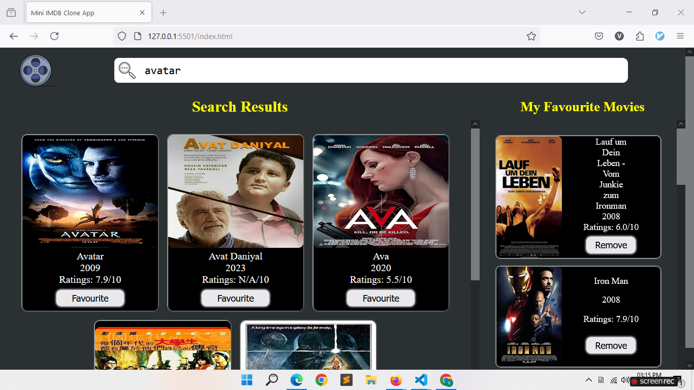
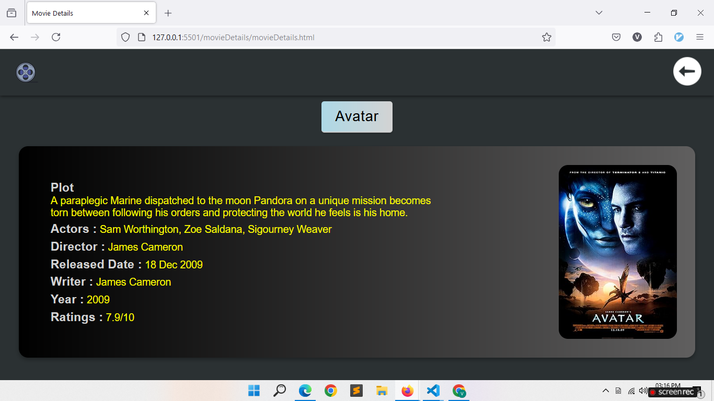

# Mini IMDb Clone

This project was developed as part of a Coding Ninjas skill test to demonstrate proficiency in front-end web development using HTML, CSS, and JavaScript.





## Overview

This application mimics IMDb functionality, allowing users to search for movies, view details, and manage their favorites. Built with vanilla JavaScript, HTML, and CSS, it integrates with the OMDB API to provide movie information.

## Hosted Link

#### [Mini IMDb Clone](https://your-username.github.io/mini-imdb-clone/)

## YouTube Video

#### [Mini IMDb Clone Project Video](https://youtu.be/your-video-id)

## Features

- Search for movies by title.
- View movie details including plot, actors, and ratings.
- Add and remove movies from the favorites list.
- Responsive design for various screen sizes.

## Usage

1. Clone this repository to your local machine:
    ```bash
    git clone https://github.com/your-username/mini-imdb-clone.git
    ```

2. Navigate to the project directory:
    ```bash
    cd mini-imdb-clone
    ```

3. Open `index.html` in your preferred web browser to use the application.

## Files

- `index.html`: The main HTML file for the application.
- `style.css`: The CSS file for styling the main application.
- `script.js`: The JavaScript file containing the core functionality of the main application.
- `movieDetails/`: Folder containing movie details page files:
  - `movieDetails.html`: HTML file for the movie details page.
  - `movieDetails.css`: CSS file for styling the movie details page.
  - `movieDetails.js`: JavaScript file containing functionality for the movie details page.

## Technologies Used

- HTML
- CSS
- JavaScript
- OMDB API
